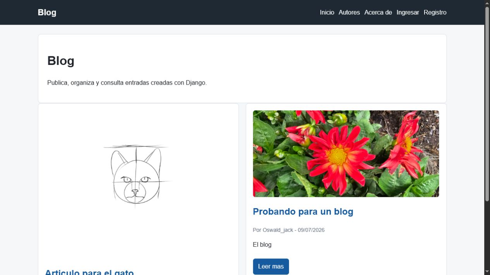
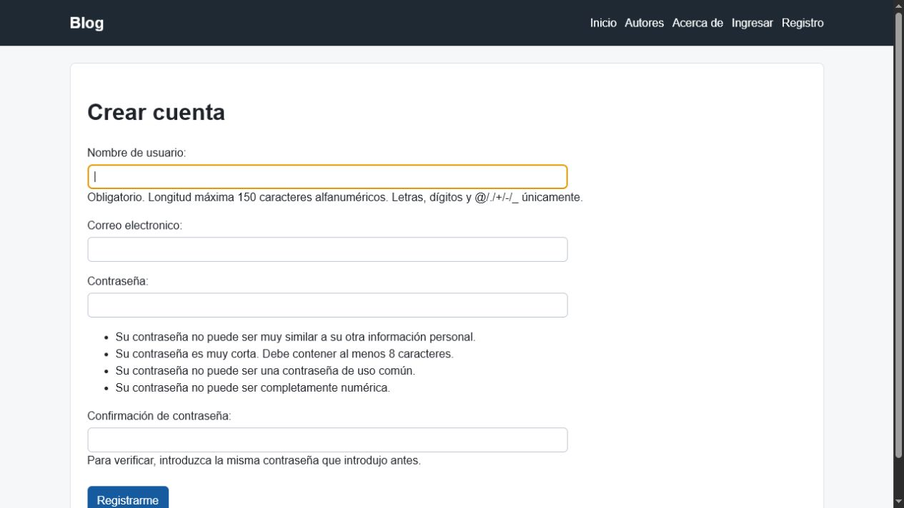
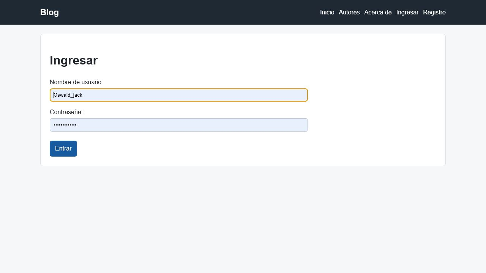
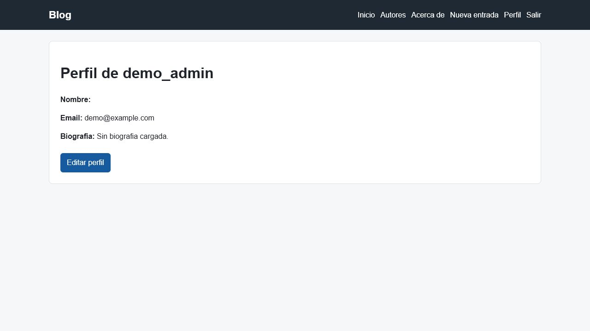
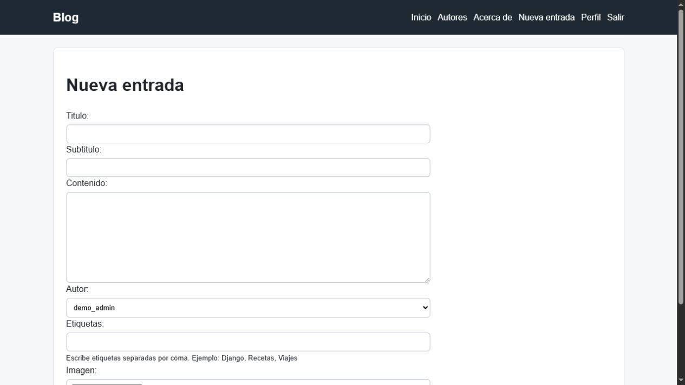
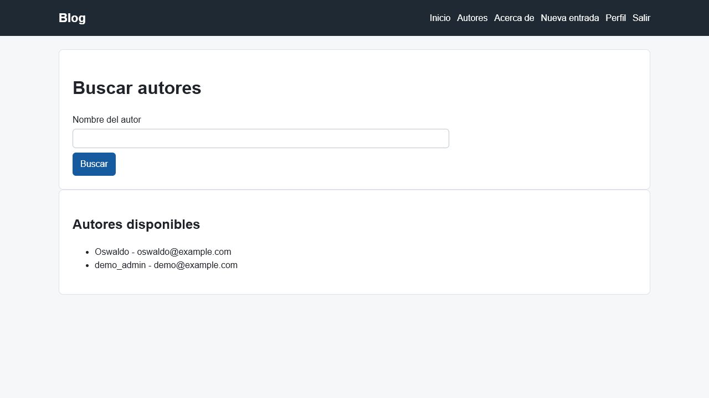
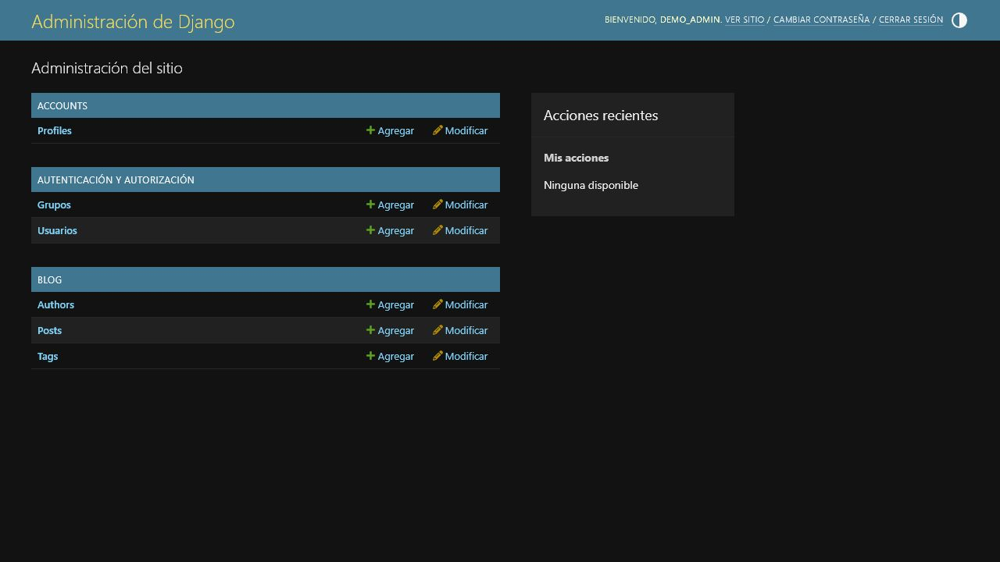

# Blog

Blog es una aplicación web desarrollada con Django. Permite que los usuarios se registren, administren su perfil y publiquen entradas con título, subtítulo, contenido, imagen y etiquetas. Cada entrada puede consultarse, editarse o eliminarse, mientras el panel administrativo permite gestionar usuarios, autores, etiquetas y publicaciones.

Repositorio público: [github.com/darkoso11/Mi_blog_entrega_Final](https://github.com/darkoso11/Mi_blog_entrega_Final)

## Funcionalidades

- Panel administrativo de Django en `/admin/`.
- Registro, login y logout de usuarios.
- Perfil de usuario con edicion de datos basicos, biografia y avatar.
- Administracion de autores y etiquetas desde Django Admin.
- Busqueda de autores por nombre.
- Listado y detalle de entradas publicadas.
- Creacion, edicion y eliminacion de entradas.
- Permisos para que solo el autor o un administrador edite o elimine una entrada.
- Página estática de acerca de.
- Context processor para mostrar el nombre del sitio.
- Template tags/filtros personalizados para formato de fecha.
- Manejo de archivos estaticos y media.
- Preparacion basica para deploy con WhiteNoise, Gunicorn y Procfile.

## Requisitos

- Python 3.13.
- pip.
- Entorno virtual recomendado.

## Instalacion local

```bash
git clone https://github.com/darkoso11/Mi_blog_entrega_Final.git
cd Mi_blog_entrega_Final
python -m venv .venv
.venv\Scripts\activate
pip install -r requirements.txt
python manage.py migrate
python manage.py createsuperuser
python manage.py runserver
```

Luego abre:

```text
http://127.0.0.1:8000/
```

## Usuario administrador

El repositorio no incluye `db.sqlite3`, por lo que cada evaluador debe crear su propio usuario:

```bash
python manage.py createsuperuser
```

Despues se puede entrar al panel en:

```text
http://127.0.0.1:8000/admin/
```

## Datos de demostración

La base de datos local, los usuarios y sus contraseñas no se incluyen en el repositorio. Cada instalación comienza con una base limpia después de ejecutar las migraciones. El evaluador puede registrar un usuario desde la aplicación, crear un superusuario y publicar sus propias entradas.

Las capturas de este README muestran contenido de demostración creado localmente y sirven como evidencia del funcionamiento esperado.

## Archivos estaticos y media

Para preparar archivos estaticos en un entorno de despliegue:

```bash
python manage.py collectstatic --noinput
```

Las imagenes subidas por usuarios se guardan en `media/`.

## Despliegue o URL pública

El despliegue está documentado mediante una simulación reproducible para Render porque esta copia no mantiene un servicio público permanente. La configuración acepta las variables de entorno de Render, y el procedimiento completo está en [`docs/deploy.md`](docs/deploy.md).

Para Render se incluye:

- `Procfile`
- `gunicorn`
- `whitenoise`
- `docs/deploy.md`

Para una demostración temporal con Ngrok:

```bash
python manage.py runserver
ngrok http 8000
```

La URL temporal que genere Ngrok puede utilizarse en la demostración y en la presentación.

## Evidencia visual

Las capturas incluidas en `docs/images/` muestran las funcionalidades principales:

### Página inicial y navegación



### Registro e inicio de sesión





### Perfil de usuario



### Creación de contenido



### Búsqueda de autores



### Panel administrativo


